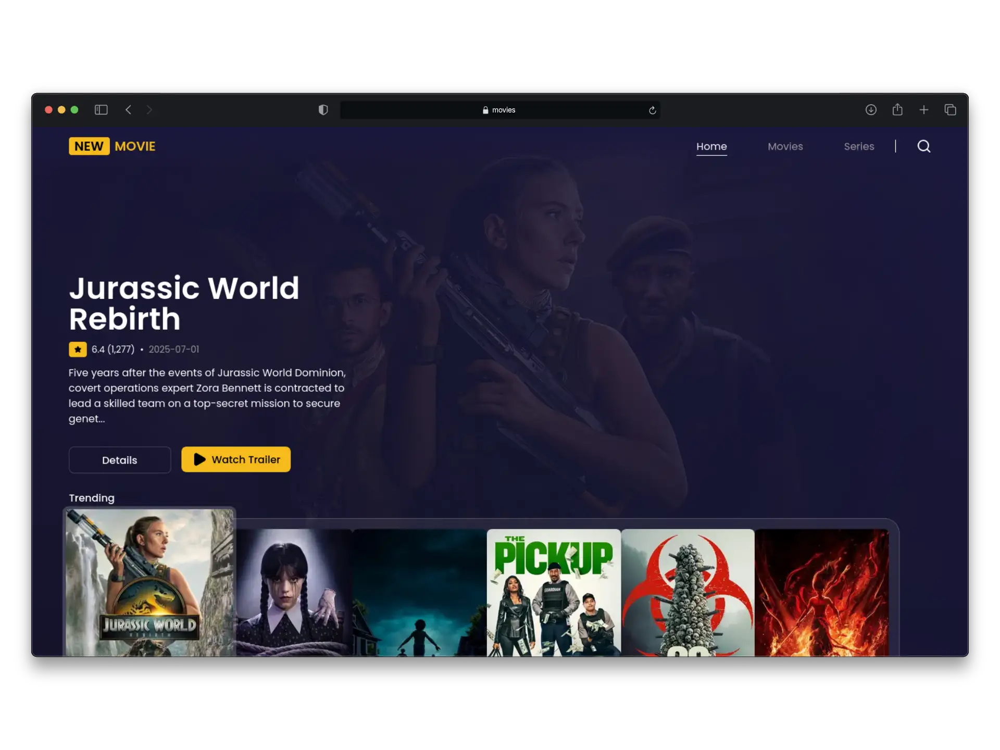
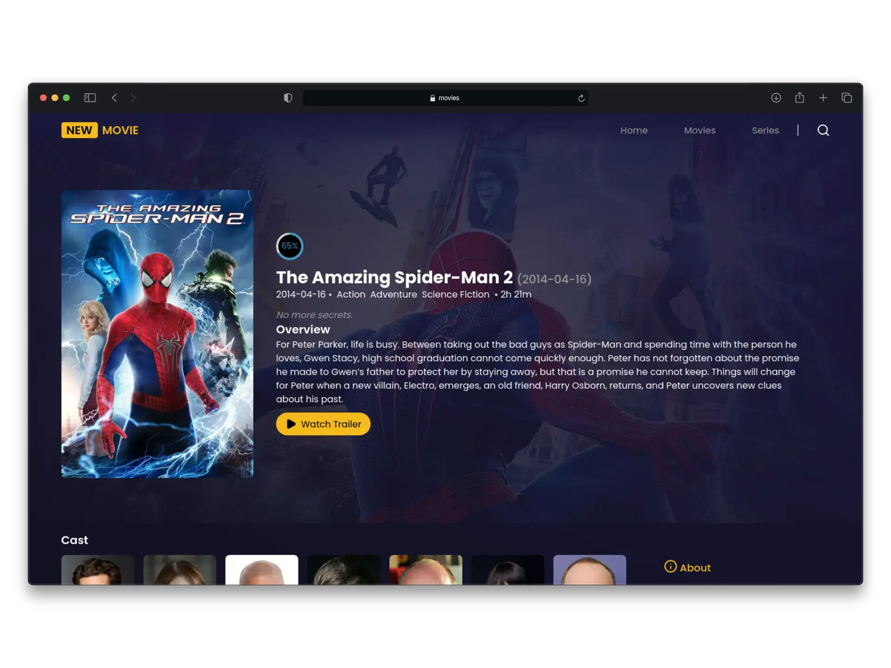
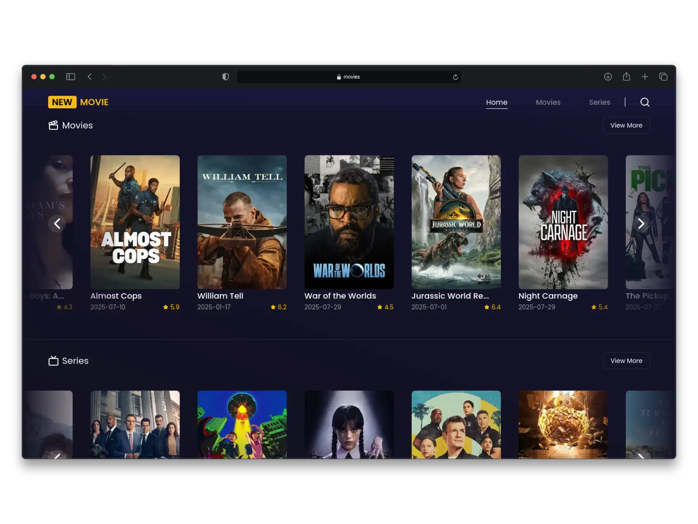

# Movies - Explore movies and series

### Description
Web application built with Next.js to explore the latest movies and series, featuring a search tool and custom filters. It connects to an external API to display real-time information. Implemented using best practices such as Server Components, dynamic routes, and efficient client-side state management. The interface is modern, responsive, and optimized for smooth performance.

### Links

[Link to Web](https://movies-iota-one-13.vercel.app/)

### Tech Stack
* React
* Nextjs
* Typescript
* Vercel
* Tailwind
* Zustand

### Screenshots

